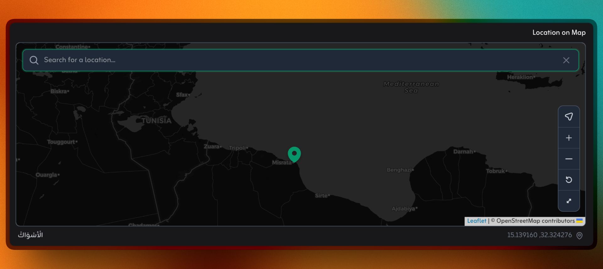

# Filament Map Picker (Leaflet + OpenStreetMap)

A simple, polished **Filament v5** map picker field built on **Leaflet + OpenStreetMap** (free services only).

## Screenshots
### Light Mode — Search & Suggestions


### Dark Mode — Controls & Theme Matching


## Goals (v1)

- Fast to install, no API keys required
- Great UX: search, collapsible search, my-location, reset, fullscreen, zoom buttons
- Dark / light theme compatible
- RTL-friendly search input (`dir="auto"`)
- SPA-safe (cleans up on Filament/Livewire navigation)

## Non-goals (v1)

- Paid providers (Google / Mapbox)
- Drawing tools (polygons, GeoJSON, etc.)

## Requirements

- PHP `^8.2`
- Laravel `^11` or `^12`
- Filament `^5`

## Installation

```bash
composer require salemaljebaly/filament-map-picker
```

Publish config (optional):

```bash
php artisan vendor:publish --tag=filament-map-picker-config
```

## Basic Usage (Form)

This component writes to your latitude/longitude fields. Keep the map field itself non-dehydrated.

```php
use Filament\Forms;
use SalemAljebaly\FilamentMapPicker\MapPicker;

Forms\Components\Hidden::make('latitude')->rules(['nullable', 'numeric']),
Forms\Components\Hidden::make('longitude')->rules(['nullable', 'numeric']),

MapPicker::make('location')
    ->label('Location')
    ->latlngFields('latitude', 'longitude')
    ->searchable()
    ->collapsibleSearch()
    ->draggable()
    ->height(320),
```

## Usage (Infolist / View)

```php
use SalemAljebaly\FilamentMapPicker\MapView;

MapView::make('location')
    ->label('Location')
    ->latlngFields('latitude', 'longitude')
    ->height(240),
```

## Configuration

Defaults live in `config/filament-map-picker.php`.

Common options:

- `default_location.lat`, `default_location.lng`
- `default_zoom`
- `height`
- `marker.color`, `marker.draggable`
- `auto_dark_mode`
- `tile_provider` (`osm`, `cartodb_light`, `cartodb_dark`)
- `controls.my_location`, `controls.fullscreen`, `controls.reset`
- `control_position` (`topleft`, `topright`, `bottomleft`, `bottomright`)
- `search.enabled`, `search.collapsible`, `search.throttle_ms`, `search.min_length`, `search.limit`
- `search.nominatim.email` (env: `NOMINATIM_EMAIL`)

## Customizing Icons

Icons are Blade views under:

- `resources/views/icons/*.blade.php`

To override icons in your app, create matching files here:

- `resources/views/vendor/filament-map-picker/icons/*.blade.php`

For consistent theming, make sure your SVGs use `stroke="currentColor"` / `fill="currentColor"` instead of hard-coded colors.

## Geolocation Notes

The browser geolocation API requires HTTPS (except `localhost`). If it fails, it’s usually due to:

- Permission denied in the browser
- Non-HTTPS site
- Location services disabled (OS / browser)

## Nominatim (Search) Notes

Nominatim has usage policies and rate limits. Browser requests can’t reliably set a custom `User-Agent` header.

If you expect heavy usage, proxy geocoding through your backend. For light usage, configure:

```env
NOMINATIM_EMAIL="you@example.com"
```

